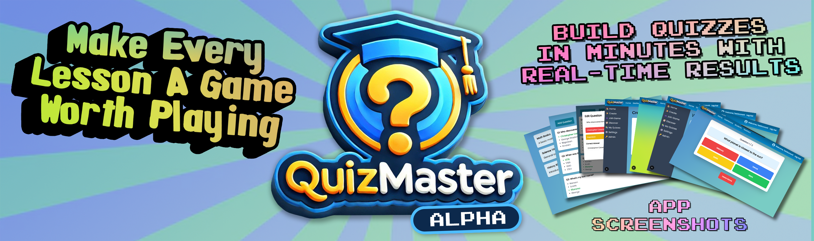

  

  <h1>QuizMaster: Engaging Learning Through Play</h1>

  <h4>
    QuizMaster is a dynamic, educational app designed to transform K–12 instruction into an interactive, game-based experience.
    Built for classrooms of today and tomorrow, QuizMaster empowers educators and students to explore, learn, and grow in an environment
    that is both fun and enriching. Best of all, it integrates modern teaching methodologies to ensure it meets the diverse needs of educators and learners.
  </h4>

  <!-- Row 1: Core -->
  
  
  

   

  <!-- Row 2: Meta -->
  
  
  
  

---

## Features
### **For Educators**
- **Custom Quizzes**: Create engaging quizzes tailored to your curriculum and classroom needs.
- **Standards Alignment**: Build quizzes that adhere to Next Generation Standards and other pedagogical models to reinforce key learning objectives.
- **Real-Time Feedback**: Track student performance with detailed analytics to identify strengths and areas for growth.
- **Gamified Learning**: Introduce points, leaderboards, and rewards to foster a spirit of healthy competition.

### **For Students**
- **Interactive Gameplay**: Play and learn with quizzes designed to challenge and entertain.
- **Level Up**: Earn points, unlock achievements, and climb the leaderboards.
- **Collaboration and Competition**: Join teams or go solo to tackle quizzes in a variety of game modes.
- **Personalized Learning**: Receive instant feedback to guide your learning journey.

### **For Everyone**
- **Accessible Anywhere**: QuizMaster works seamlessly on desktops, tablets, and smartphones, ensuring learning never stops.
- **Safe and Secure**: Prioritizing student safety with robust data protection and privacy features.

---

## Game Modes
### **Classic Quiz**
Compete individually or as teams to answer questions and score points. Perfect for classroom reviews or friendly competitions.

### **Timed Challenge**
Race against the clock to answer as many questions as possible. Great for honing quick thinking and decision-making skills.

### **Collaborative Play**
Work together in teams to solve problems, fostering cooperation and teamwork.

### **Master Mode**
An exciting boss-level challenge where students face increasingly difficult questions to "master" a topic.

---

## Pedagogical Alignment
QuizMaster isn’t just fun—it’s educationally sound. We’ve designed it to align with:

### **Next Generation Learning Standards**
- Focus on critical thinking, collaboration, and problem-solving.
- Questions categorized by grade level, subject area, and skill.

### **Modern Teaching Practices**
- Supports differentiated instruction by allowing educators to tailor quizzes to individual or group learning needs.
- Encourages active participation and engagement.

### **Inclusive Design**
- Designed for diverse learning needs, with accommodations for different abilities and learning styles.
- Multilingual support ensures inclusivity for non-native speakers.

---

## Future Features
- **Interactive Flashcards**: Help students prepare for quizzes with fun and engaging flashcards.
- **Customizable Avatars**: Allow students to personalize their gaming experience.
- **Teacher Marketplace**: Share and discover quizzes created by other educators.
- **Badges and Rewards**: Introduce badges for completing challenges and reaching milestones.

---

## Why QuizMaster?
QuizMaster turns learning into an adventure. By gamifying education, we:
- Increase student motivation and engagement.
- Build confidence in learners of all abilities.
- Empower educators with tools to create impactful learning experiences.

---

## Getting Started
1. **Sign Up**: Create an account as a teacher, student, or parent.
2. **Explore**: Dive into our library of pre-made quizzes or create your own.
3. **Play**: Start a quiz and watch the learning magic happen!

---

Join the QuizMaster community and take education to the next level!

